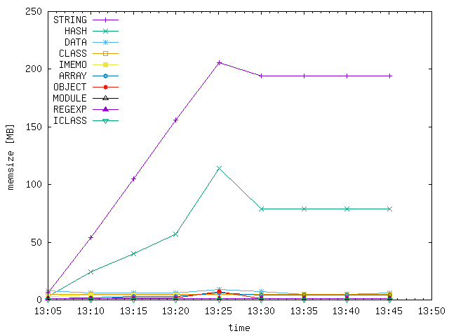
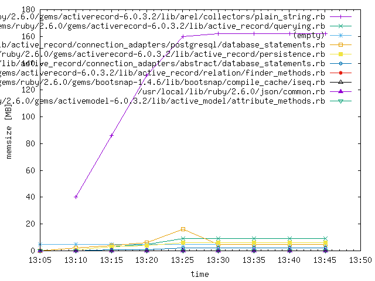

# Finding Ruby Memory Leaks

### Ruby ObjectSpace

In Ruby 2.1+, ObjectSpace provides information and tools to understand the current state of your application, such as a memory allocation tracer and heap dumper for static analysis.

#### Code Snippets

Heap Dump 

```ruby
require 'objspace'

GC.start
open("/tmp/ruby-heap-#{Time.now.strftime('%s')}.dump", "w") do |io|
  ObjectSpace.dump_all(output: io)
end
```

Top 10 Object Count

```ruby
ObjectSpace.each_object.inject(Hash.new 0) { |h,o| h[o.class] += 1; h }.sort_by { |k,v| -v }.take(10).each { |klass, count| puts "#{count.to_s.ljust(10)} #{klass}" }
```


#### References

- [Ruby 2.1: objspace.so](http://tmm1.net/ruby21-objspace/)
- [What’s Happening in Your Ruby Application?](https://www.rubyguides.com/2016/09/object-space/)
- [Demystifying the Ruby GC](https://samsaffron.com/archive/2013/11/22/demystifying-the-ruby-gc)
- [Watching and Understanding the Ruby 2.1 Garbage Collector at Work](https://thorstenball.com/blog/2014/03/12/watching-understanding-ruby-2.1-garbage-collector/)


### rbtrace gem

The [rbtrace gem](https://github.com/tmm1/rbtrace) is a general ruby process introspection gem, designed to provide insight into running ruby processes. It can be used for various live debugging and heap dumping of a live ruby process.

#### References

- For a quick overview of rbtrace: [How to Debug Ruby Performance Problems in Production](https://www.justinweiss.com/articles/how-to-debug-ruby-performance-problems-in-production/)
- [Debugging memory leaks in Ruby](https://samsaffron.com/archive/2015/03/31/debugging-memory-leaks-in-ruby)

#### Code Snippets

Dump the heap for a running process using rbtrace. Note: ensure your process has [required rbtrace](https://github.com/tmm1/rbtrace#require-rbtrace-into-a-process) first.

```bash
bundle exec rbtrace -p 6552 -e 'Thread.new{GC.start;require "objspace";io=File.open("/tmp/ruby-heap-#{Time.now.strftime("%s")}.json", "w"); ObjectSpace.dump_all(output: io); io.close}'
```


## Putting it Together - Using Time Based Analysis to Find a Leak

#### 0. Prerequisites

0.1 [Local Postgres database](https://postgresapp.com)

0.2 [Ruby 2.1+](https://github.com/rbenv/rbenv) with [bundler](https://bundler.io)

0.3 [Homebrew](https://brew.sh)

0.4 [Xcode](https://apps.apple.com/ca/app/xcode/id497799835?mt=12)

#### 1. Generate

Setup to capture your process's heap information

1.1 Add rbtrace to your Gemfile

```ruby
gem 'rbtrace'
```

The process to be monitored will need to be restarted so that rbtrace is attached.

1.2 Save heap dumps at various intervals

```bash
bundle exec rbtrace -p 6552 -e 'Thread.new{GC.start;require "objspace";io=File.open("/tmp/ruby-heap-#{Time.now.strftime("%s")}.json", "w"); ObjectSpace.dump_all(output: io); io.close}'
```

1.3 Copy the heap file(s)

```bash
cp <heap_files> heap_files/
```


#### 2. Gather

2.1 Install the required dependencies

```bash
brew bundle
```

and

```bash
bundle install
```

2.2 Create the database

```bash
bundle exec createdb.rb
```

2.3 Import the heap files

```bash
bundle exec gencsv.rb
```

```bash
sh genimport.sh | psql mem_analysis
```

#### 3. Analyze

Now that the database is loaded, we're ready to analyze the information. To find out what is causing a memory leak, we can look at graphs plotting memory usage over time in different dimensions. This is done by `graph.rb`. Let's start with the object type.

```bash
bundle exec graph.rb type-mem; open graph-type-mem.png
```

This will create the file *graph-type-mem.png* showing the total size of objects by type. If there's one thing leaking, you'll probably have a number of somewhat flat lines, and one with a positive slope, which is the culprit.

Then create a similar graph for that object type only, and plot lines by file, for example. This gives one an idea in which gem the leaking objects may be created. If it's a string, run

```
bundle exec ruby graph.rb string-mem; open graph-string-mem.png
```

If it's something else, edit *graph.rb* and expand the `case`-block. In this way you may be able to zoom in on the cause.

Example showing a possible leak of strings:



